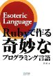

このページは書籍「Rubyで作る奇妙なプログラミング言語」のサポートサイトです。

## 第二版

絶版になっていた本書ですが、第二版として復刻されることになりました。

* [マイナビBooks](https://book.mynavi.jp/ec/products/detail/id=24268) (紙版・電子版)
* [達人出版会](http://tatsu-zine.com/books/esoteric-language-programing-in-ruby) (電子版)

初版との違いは、誤植が修正されているのと、Rubyのインストール方法の項をアップデートした点です(つまり内容的には初版と同じです)。

ちなみに同時発売は[アセンブラ短歌の本](https://book.mynavi.jp/ec/products/detail/id=24267)です :-) こちらもぜひご検討ください。

## 初版

(こちらの表紙のものは絶版です。)

Powered By  [Route477.net](http://route477.net)
