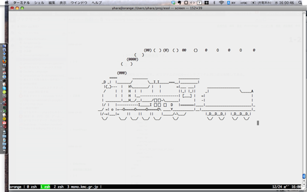

## 練習問題の解答例

各章末の練習問題の解答例です。

### 1-1

#### Q1

回答例はこちら。

```
puts"Hello, world!"
```

以上で19バイト。現在のRubyの文法では、これが最短だろう。
(「ファイルに保存したら20バイトになったよ」という人は、末尾に余計な改行が付いているものと思われる。)

別解として、

```
$><<"Hello, world!"
```

というのもある。

「$>」は「$stdout」という組み込み変数の別名で、標準出力を表すIOオブジェクトだ。なので、「$> << "Hello, world!"」とするとIOクラスのインスタンスメソッド「<<」が呼び出され、「Hello, world!」という文字列が標準出力に出力されるというわけだ(細かいことを言うと、putsだと最後に改行が出力されるが、<<だと改行が出力されないという違いがある)。

#### Q2

解答例はこちら(281バイト)。あなたはこれよりも短くできただろうか？:-)

```
b=proc{|n,w|"#{n==0?'no more':n} bottle#{'s'unless n==1} of beer#{' on the wall'if w}"}
puts ["#{b[99,1]}, #{b[99,p]}.",(0..98).map{|n|["Take one down and pass it around, #{b[n,1]}.","","#{b[n,1].capitalize}, #{b[n,p]}."]}.reverse, "Go to the store and buy some more, #{b[99,1]}."]
```

あるプログラムをできるだけ少ないバイト数で書くという遊びは、一般に
「ショートコーディング」や「コードゴルフ」という名前で知られている。
1バイトでも短いコードを書いた人が勝ちというルールを、
少ない打数でゴール地点を目指すゴルフ競技になぞらえたわけだ。

ゴルフに興味を持った方は、「[Code Golf](http://codegolf.com/)」や「[anarchy golf](http://golf.shinh.org/)」
といったサイトに挑戦してみるといいだろう。
また、Rubyに関する記事を集めたWeb雑誌、「[Rubyist Magazine](http://jp.rubyist.net/magazine/)」(通称るびま)でも[ゴルフについての記事](http://jp.rubyist.net/magazine/?0021-RubiMaGolf)が掲載されている。


#### Q3

回答例はこちら。

```
puts format(x="puts format(x=%p, x)", x)
```

一見何がどうなっているのか分からないと思うが、実際に実行して結果を確かめてほしい。「"」を出力するためにformatメソッドの「%p」というパターンを使っているのがポイントだ。%pを使うと、引数(この場合ならxだ)のinspectメソッドを呼んだ結果がその場所に埋め込まれる。

ちなみにformatと同じことを行うString#%という関数もある。
こちらを使うともう少し短くできる。

```
puts (x="puts (x=%p) %% x") % x
```

最後の「% x」を出力するために、文字列中では「%% x」と「%」を2つ書かないといけないことに注意。formatやString#%に渡す文字列の中では「%」は特殊な意味を持つので、「%」自身を出力するときは「%%」と書かなくてはならない。

### 1-2

回答例を以下に示す。オリジナルのHQ9+インタプリタと同じ点は省略してある。

```
require 'counter'
require 'rubygems'
require 'sl'

class HSQ9Plus
  # (略)

  def run
    @src.each_char do |c|
      case c
      when "H"
        hello
      when "S"
        run_sl
      when "Q"
        print_source
      when "9"
        print_99_bottles_of_beer
      when "+"
        increment
      end
    end
  end

  private

  # (略)

  def run_sl
    SL.run!
  end

  # (略)
end

HSQ9Plus.new(ARGF.read).run
```

筆者が考えたHSQ9+言語では、S命令を実行すると画面にSLが走る。



ソースコードの全体は以下からダウンロードできる。

* [hsq9plus.rb](https://github.com/yhara/esolang-book-sources/blob/master/_practices/hsq9plus.rb)

SLを走らせるために、[pebbles-sl](https://github.com/cesare/pebbles-sl)というライブラリが必要だ。以下のようにしてインストールしてほしい。

````
$ gem install pebbles-sl
````

### 1-3

回答例は以下。

```
Brainf*ckの各命令を、以下のように置き換える。
> : else
< : while 
+ : if 
- : do
. : until
, : for
[ : then
] : end
```

すると、1-3で出てきた「Aという文字を出力するプログラム」は以下のようになる。

```
if if if if if if
then else if if if if if if if if if if while do end
else if if if if if until
```

筆者はこの言語を「Uncontrollable」と名付けた。「The Uncontrollable programming language」である。

英語で「control structure」と言えば制御構造、つまりifやwhileなどプログラムの実行を制御するもののことを言う。しかし、この言語では見た目こそ「if」や「while」などの制御構造に使われる単語が並んでいるが、その意味は「数値を1増やす」だったり「ポインタを左に移動する」だったりして、さっぱり制御する気がない。そこで「Uncontrollable」というわけだ。

#### 実装

実装は以下のようになる。

* [uncontrollable.rb](https://github.com/yhara/esolang-book-sources/blob/master/_practices/uncontrollable.rb)

オリジナルのBrainf*ckと違い、命令が文字単位ではないので、
ソースコードを命令に区切るのにString#charsではなくString#splitを使っているのが違いだ。

### 1-4

無限に「A」という文字を表示しつづけるWhitespaceプログラムは以下のようになる。 

* [forever_a.ws](https://github.com/yhara/esolang-book-sources/blob/master/_practices/forever_a.ws)

分かりやすく書くと、こうだ。

```
[LF][Space][Space][Space][LF]
[Space][Space][Space][Tab][Space][Space][Space][Space][Space][Tab][LF]
[Tab][LF][Space][Space]
[LF][Space][LF][Space][LF]
```

それぞれの行が、Ruby風にいうと以下のような命令に対応している。

```
label "s"                                                                 
push 65                                                                 
char_out                                                                
jump "s"
```

label命令とjump命令が無限ループを実現していて、その間に挟まれた命令がループごとに実行される処理だ。
このWhitespaceプログラムは決して終わらないので、exit命令は使っていない。

### 2-1

#### Q1

回答例は以下。

* [hello.sta](https://github.com/yhara/esolang-book-sources/blob/master/_practices/hello.sta)

```
            +               +  *       +    
 * + .        +              +  *       +   
  *     * + .            +     * + . + .    
    +     * + .              +            + 
 *         +     * * + .                 + *
 + .              + +  *           +     *  
   * + .             + * + .        +     * 
+ .           + * + .             + * + .   
           +            +  *         +     *
 * + .
```


#### Q2

回答例は以下。

* [fibs.sta](https://github.com/yhara/esolang-book-sources/blob/master/_practices/fibs.sta)
以下のような命令を使用している。

```
[:push, 0]   # 0
[:push, 1]   # 0 1
[:label, 1]              # ループの飛び先
  [:dup]       # 0 1 1
  [:rotate]    # 1 0 1
  [:+]         # 1 1
  [:dup]       # 1 1 1
  [:num_out]   # 1 1 
  [:push, 10]  # 1 1 10
  [:char_out]  # 1 1     # 改行が出力される
  [:dup]       # 1 1 1
[:jump, 1]   # 1 1
```

#### Q3

回答例は以下。

* [fibn.sta](https://github.com/yhara/esolang-book-sources/blob/master/_practices/fibn.sta)

以下のような命令を使用している。

```
[:push, 0],   # 0
[:push, 1],   # 0 1
[:num_in],    # ユーザが「10」を入力したとすると
              # 0 1 10
[:label, 1],
  [:rotate],    # 10 0 1
  [:dup],       # 10 0 1 1
  [:rotate],    # 10 1 0 1
  [:+],         # 10 1 1
  [:dup],       # 10 1 1 1
  [:num_out],   # 10 1 1
  [:push, 10],
  [:char_out],
  [:rotate],    # 1 10 1
  [:rotate],    # 1 1 10
  [:push, 1],   # 1 1 10 1
  [:-],         # 1 1 9
  [:dup],       # 1 1 9 9
[:jump, 1]      # 1 1 9
```

### 2-2

FizzBuzzプログラムを書くには、割り算の余りをとる操作が必要だ。というわけで、これを命令として追加してしまうのが簡単だろう。

「%」で割り算の余りを計算できるRubyに倣って、筆者は全角の「％」にこの操作を割り当てることにした。
優先度もRubyの「%」を真似て、かけ算や割り算と同じにすることにした。

％命令を実装するには、以下の2箇所を書き換えればいい。

```
*** bolic_intp.rb       2008-11-24 14:18:32.000000000 +0900
--- bolic_intp2.rb      2008-12-26 21:46:33.000000000 +0900
***************
*** 32,37 ****
--- 32,39 ----
          eval(tree[1]) * eval(tree[2])
        when :/
          eval(tree[1]) / eval(tree[2])
+       when :%
+         eval(tree[1]) % eval(tree[2])
        when :char_out
          print eval(tree[1]).chr
          nil
***************
*** 188,193 ****
--- 190,197 ----
          [:*, left, parse_multiple]
        elsif match?("÷")
          [:/, left, parse_multiple]
+       elsif match?("％")
+         [:%, left, parse_multiple]
        else
          left
        end
```

こうすると、以下のようなFizzBuzzプログラムを実行できるようになる。

* [fizzbuzz.bol]( https://github.com/yhara/esolang-book-sources/blob/master/_practices/fizzbuzz.bol)

#### 100までのループを書く方法

Bolicにはwhile命令があるので、1から100まで繰り返すには、まず1が代入された変数を用意し、
ループを実行するごとにそれを1だけ増やして、101になったらループを抜ければいい。

ループを抜ける条件を思いだそう。Bolicのwhileループは、数値が0以外のとき処理を実行し、数値が0ならループを抜けるのだった。
ということは、「変数から101を引いた結果」をループの条件にすれば、
変数が101になったときにうまくループを抜けることができる。

#### 条件を否定する方法

BoilcにはRubyでいう「not」がない。

これを命令として追加してもいいが(与えられた数が0なら1を、0以外なら0を返す命令になるだろう)、
Bolicのif命令をうまく使うと、指定した条件が「成り立たなかったときだけ」ある処理を行うことができる。
つまり、if-then-elseのthen節に何も書かず、else節にだけ処理を書いておくのだ。

#### 余談

設問では「1つ以上の命令を追加し…」としか書いていないため、％命令に限らず、

* 実行すると「Fizz」という文字列を表示する命令
* 整数が負かどうかを判定する命令
* 実行すると指定した数までのFizzBuzzプログラムを実行する命令(!)

など、いろいろな方法が考えられるだろう。Bolicはあなたの言語なのだから、どんな命令を追加するのも、あなたの思いのままだ。

### EX

以下は筆者の作成したEsoteric Languageである。

#### ModanShogi (2010)

* [将棋をモチーフにしたプログラミング言語「ModanShogi」が公開！｜gihyo.jp … 技術評論社](http://gihyo.jp/dev/column/01/prog/2010/aprilfool2010-01)
* [https://github.com/yhara/ShogiModan](https://github.com/yhara/ShogiModan)

#### smile (2011)

* [https://github.com/yhara/smile](https://github.com/yhara/smile)
